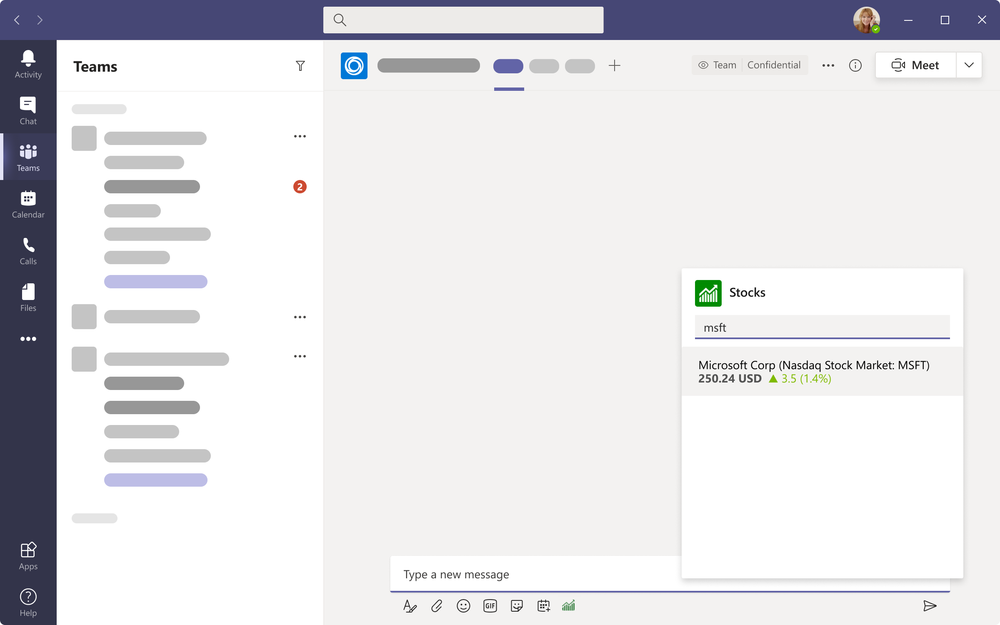
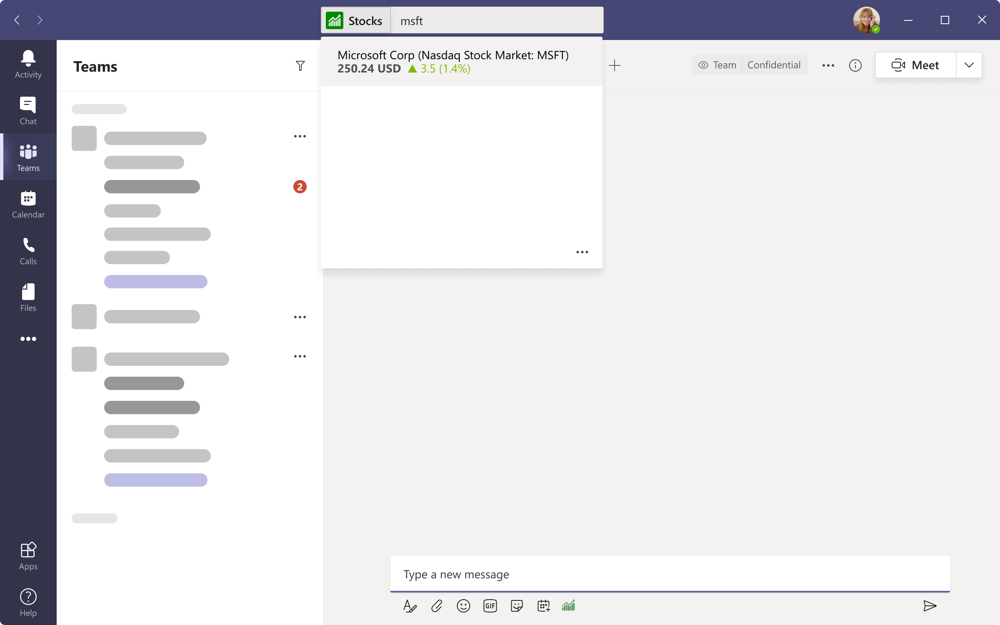
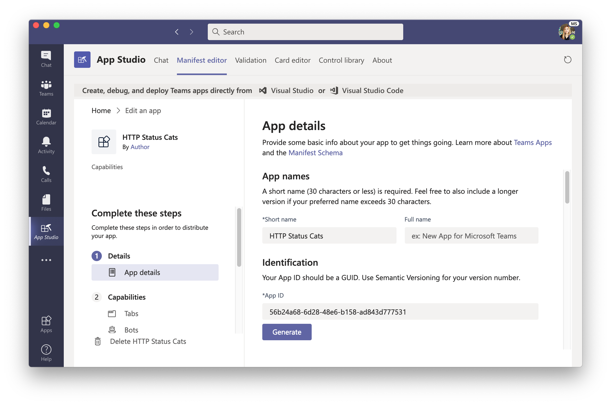
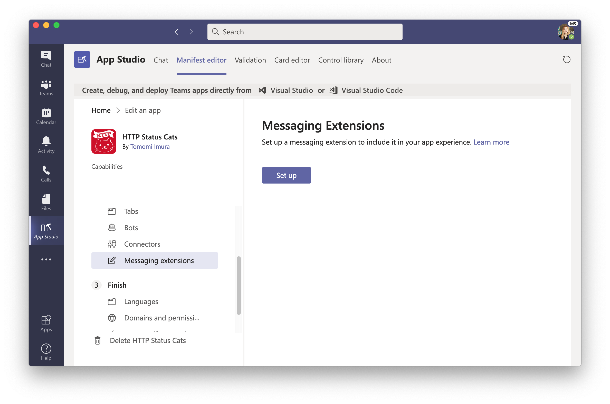
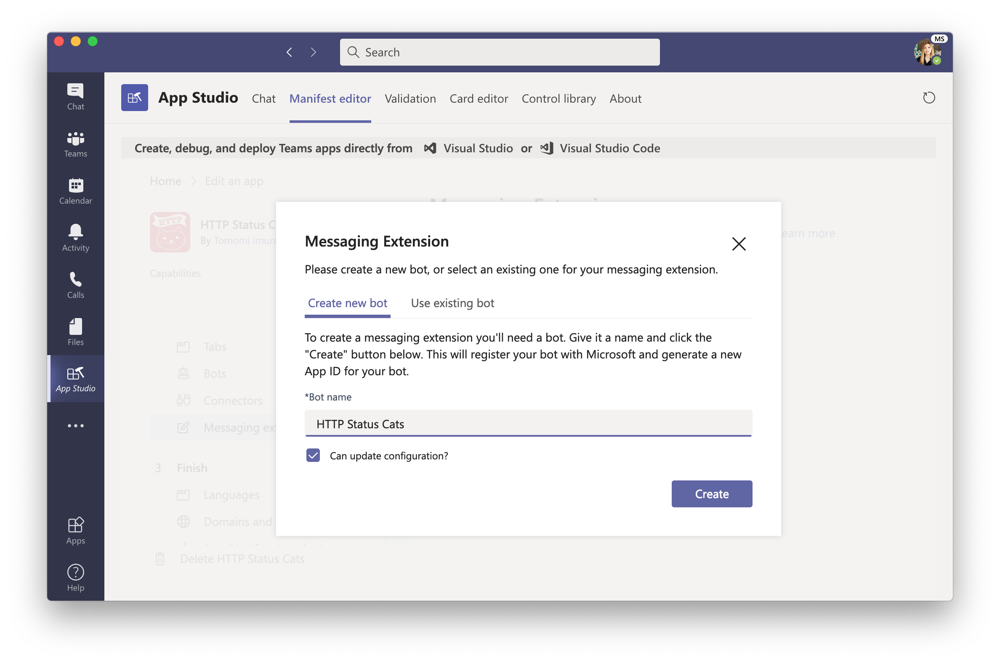
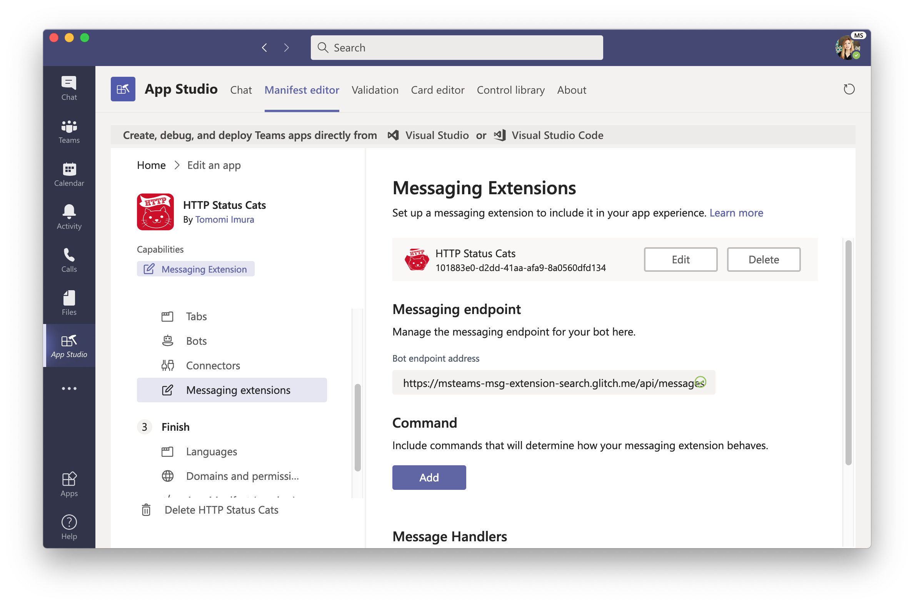
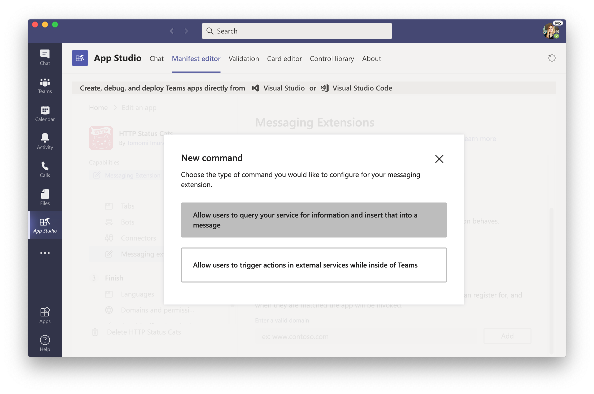
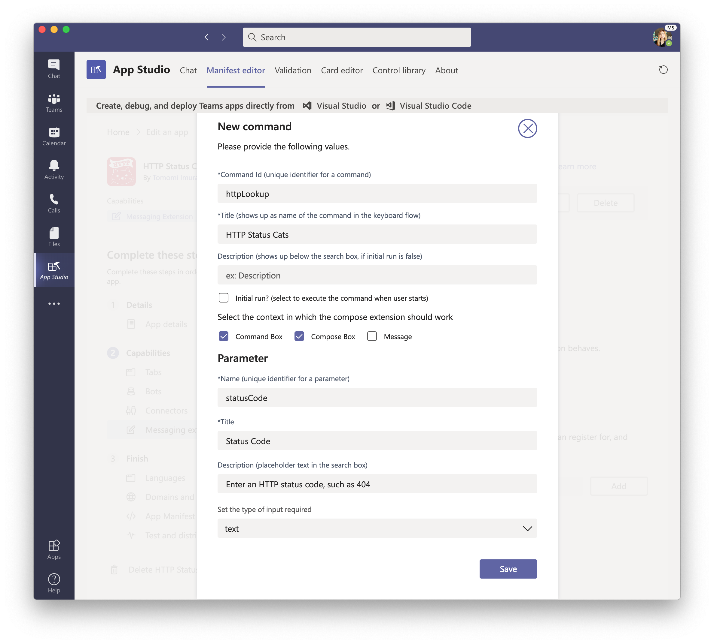

# HTTP Status Cats app for Microsoft Teams
*HTTP Status Lookup: Search Extension code example for MS Teams*

_Updated: September 2020_

This is a small sample code to build a message extention actions feature for Microsoft Teams. 
If you are familiar with Slack app development, this is equivalent to their Global Action / Slash Commands (although "/" search is not customizable in Teams).


#### Released package for side-loading

The package you can just side-load to yout MS Team client is available in [**Release**](https://github.com/girliemac/msteams-httpstatuscats/releases) section!

If you are interesting in developing your own MS Teams app by tweaking this app, or setting this app manually by yourself, read on!

## Overview: User - App Interactions

This sample shows you how to create an app using Messaging Extension, Messaging extension with search commands that allow your users to search external systems and insert the results of that search into a message

There are two places where a user action can be invoked; **Message Compose box** and **Search / Command box**.

**Message Compose box**



1. A user click the app icon (which is a monochrome/transparent background icon you define in App Studio) below the message compose box
2. In the popup, the user search an query (*e.g.* stock ticker symbol). On keyup, the app shows the available results in the popup box
3. When the user click one of the results, the content appears in the message compose box
4. The user can post the message with the search result to the channel

**Search / Command box**



1. A user click the app icon (which is a monochrome/transparent background icon you define in App Studio) below the message compose box
2. In the popup, the user search an query (*e.g.* stock ticker symbol). On keyup, the app shows the available results in the popup box
3. When the user click one of the results, the content appears in the search popup box

You can write code and make it work for both compose and search boxes or just one of them, by configuring in the manifest file. (In this tutorial, we create it using App Studio.)


## Overview: Code

### 📄 index.js

The scripts that listens to the incoming requests. Using Bot Framework ([https://www.npmjs.com/package/botbuilder](https://www.npmjs.com/package/botbuilder))

### 📄 bot.js

This files include the code to handle:

- the action invokation, where the app can grab the query from the user 
- compose the preview UI and the final UI (after the user clicks the preview) to display the result

### 📄 provacy.html & tou.html

You are required to provide the URLs of "Privacy statement" and "Terms of use". The URLs don't need to be packaged with your app, but must have them somewhere you own.

### 📁 Manifest package to be installed in Teams client

> ⚠️ You don't actually need to create these files now, unless you want to build it manually without _App Studio_

The _teams-package_ dir in this repo is nothing more than an example of what a zip file (to be installed in Teams app) contains.

```
📁 teams-package
    └── 📄 manifest.json
    └── 🖼 color.png (192x192)
    └── 🖼 outline.png (32x32)
```

See the instruction below to see how you can create your own app package using **App Studio**

---

If you want quickly try this app without running own server, try [the Glitch version of the code sample](https://glitch.com/~msteams-msg-extension-search)! 

Or fork this repo and try using a localhost tunnel like **ngrok**.

---

## App Configuration

Here's the step-by-step how to set up the ap and install on Teams-

### Prerequisites

- Microsoft 365 developer tenant ([Sign up if you don't have one already!](https://developer.microsoft.com/en-us/microsoft-365/dev-program))
- App Studio - look for the app in Teams desktop client and install

Also, in this example, I am using Express.js to run a Node server and handles the basic HTTP Post. 


### Creating App Manifest with App Studio

#### App Details

Open **App Studio** app in Teams client.

Then, click **Create a new app** and fill out all the required fileds including the Bot names, descriptions, etc.

At **App URLs** section, inlcude a URL of your privacy and TOU webpages. 



#### Massaging Extensions config

From the left menu, select Capabilities > **Massaging Extensions**.



Go ahead and click the button to set up.



Give it a name.

##### App Credentials

Copy the ID under your app name (something looks like `123xx567-123x-...`) and paste it as an environment variable in your _.env_ file, which is supposed to be a hidden file (Rename the `.env-sample` to `.env`).

Under **App Passwords**, generate new password, and copy it. Then paste it in your _.env_ file.




##### Configure actions

At **Messagind Endpoint**, enter `https://[your server or local tunnel]/api/messages`.

Scroll to **Command** and click "Add".

In the dialog box -

Select "Allow users to query your service for information..."




Then, fill out the command ID and title text. Also, a parameter name, its title, and the description. 
Set the type of input as **text**, then click **Save**.



#### Finish creating the app manifest package

Go to Finish > **Test and distribute**.

If you get any errors, go fix it, otherwise, click **Install** your client.

You can also download the zip file that contains `manifest.json`, and two icon images to install later or distribute.

## Test your app

In your Teams client, try the search box and the message compose box. I hope it works!

If fail, 
1. check if the info in the **.env** is correct
2. check if you point to the right endpoint. Check your server URL. (You can get your Glitch server URL by clicking the **Share** from the left side menu next to your avatar, then click **Live App** to get the base URL.)


---

## Deployment to Azure

You can deploy the app to Azure in a few different ways:

1. From [Azure portal](https://portal.azure.com) and deploy by setting up an Web App service. ([Docs](https://docs.microsoft.com/en-us/azure/app-service/app-service-plan-manage))

or

2. Use [**Azure App Services** extension](https://marketplace.visualstudio.com/items?itemName=ms-azuretools.vscode-azureappservice) in VS Code. ([Docs](https://docs.microsoft.com/en-us/azure/developer/javascript/tutorial-vscode-azure-app-service-node-01))

or

3. Set up a GitHub Action to deploy to Azure!

Of course, you can deploy to wherever you like other than Microsoft Azure!

---

## Learn more (TBD)
 
I will add more learning resources